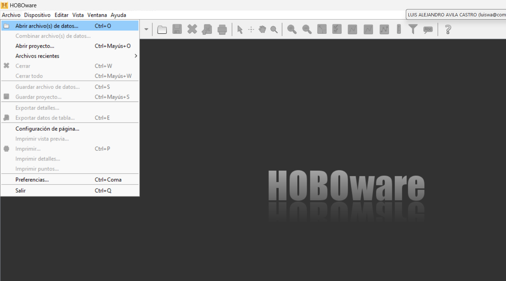
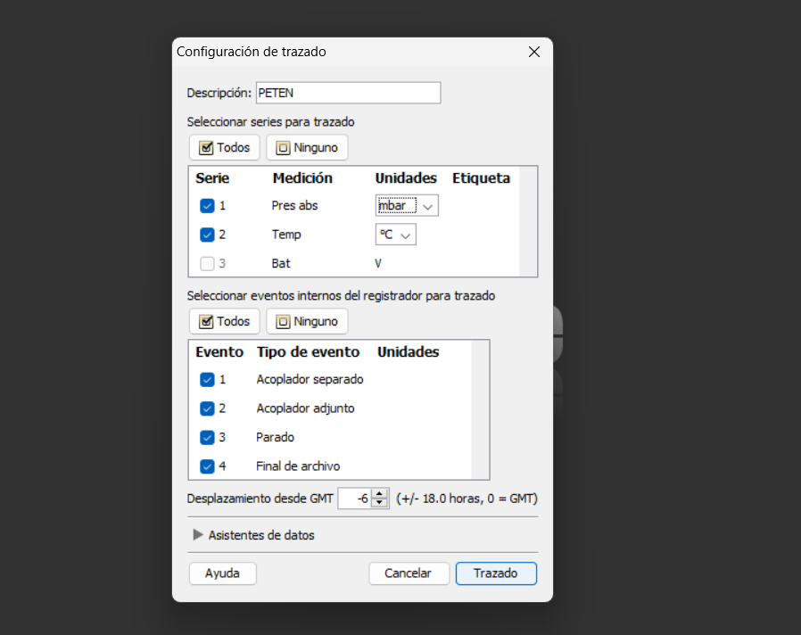
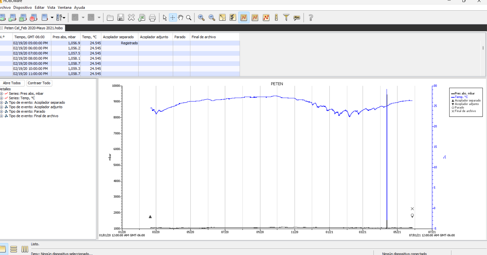
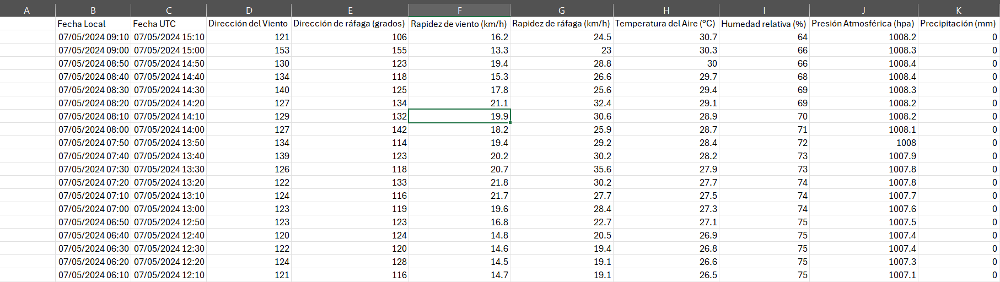

# Curso hidroperiodo

Este repositorio buscar ser un manual de referencia para la caracterización del <em><strong> hidroperiodo </strong></em> de manglares considerando las tres variables del hidroperiodo; nivel promedio de inundación (cm/mes), duración (h/mes), frecuencia (eventos/mes), así como espectro de frecuencias, utilizando series de tiempo de sensores de presión Hobbo. Así como una guía para limpiar e integrar datos del Estaciones Meteorológicas Automáticas (EMAs), datos del Servicio Mareográfico Nacional y niveles de manglar con datos del Laboratorio de Producción Primaria del CINVESTAV Mérida (LLP-Mid).

> [!IMPORTANT]
> Antes de comenzar debes instalar los siguientes programas
> - [HOBOware Software](https://www.onsetcomp.com/products/software/hoboware) Para abrir archvios de formato .hobbo
> - [Matlab](https://la.mathworks.com/?s_tid=gn_logo) Para limpieza y analisis de datos 

## Indice 
**Índice**   
1. [Introducción ](#id1)
2. [Descarga de datos](#id2)
3. [Fundamentos de Matlab](#id3)
4. [Funciones especiales ( fillmissing](#id4)
5. [Inspección series de tiempo](#id5)
6. [Corrección series de tiempo](#id6)
7. [Calculo de hidroperiodo (Duración, Promedio  Frecuencia)](#id7)
8. [Análisis de espectros](#id8)

## Introducción 
Las variaciones estacionales en el nivel de inundación y las características hidrológicas del humedal definen el hidroperiodo de los humedales. El hidroperiodo define las características de los humedales, en el caso de los manglares se ha observado que estas variaciones del hidroperiodo están relacionadas con cambios en la distribución y productividad del ecosistema. 

De acuerdo con [Mitsch & Gosselink, 2015](https://www.researchgate.net/publication/271643179_Wetlands_5th_edition) , el hidroperiodo se puede caracterizar a partir de tres variables; nivel de inundación, el cual se reporta como el nivel de inundación promedio en un intervalo de tiempo conocido; Duración de inundación, corresponde al numero de horas en las que humedal se encuentra inundado; y frecuencia de inundación, la cual se refiere al numero promedio de veces que el humedal es inundado  en un periodo de tiempo conocido. 

En el caso de la frecuencia  y duración de inundación existen diversas métricas reportadas para su caracterización, en algunos casos la duración de inundación se reporta como él % de días en los que el humedal se encuentra inundado durante un año (Crase et al., 2013), el numero de horas, horas por mes, horas por día o días por año. En el caso de la frecuencia de inundación, se reporta como el número de veces que hay un incremento de marea por mes (tides/mes), numero de días por mes que hay inundación (day/month) o el número de inundaciones por año (flooding/year). 
La descripción de las variables del hidroperiodo a partir de datos generados por sensores de presión y mediciones de campo han permitido reconocer variaciones naturales, así como cambios originados por la actividad humana. Adicionalmente, en los últimos años el hidroperiodo ha sido caracterizado con nuevas técnicas y tecnologías como los análisis de espectros, imágenes satelitales o el uso de LiDar lo que ha permitido complementar los estudios de este ecosistema.

## Descarga de datos 
### Datos de presión HOBBO 

Antes de comenzar a realizar el análisis de datos se requien obtener datos confiables sobree el área de estudio. En el caso de niveles de inundación de manglares, estos datos corresponde a los que son recuperados de datos gracias a los intrumentos colocados con antelación. Estos sensores pueden ser de dos tipos: nivel de presión inundación (HOBO Water Level Data Logger), y presión atmosferica (hobo barometric pressure logger). El primero consta de un sensor que se coloca por debajo del nivel de agua y mide presión total (presión atmosferica + presión del nivel de agua), el segundo mide exclusivamente presión atmosferica. En un caso ideal ambos sensores se encuentran operando al mismo tiempo.    

En el caso de datos de sensores de la marca Hobbo los datos se pueden recuperar del sensor utilizando la lanzadera optica del instrumento y  el software [HOBOware Software](https://www.onsetcomp.com/products/software/hoboware). 

Dentro del [HOBOware Software](https://www.onsetcomp.com/products/software/hoboware) podemos abrir los archivos .hobbo. Para esto se selecciona el archvio .hobbo dentro del navegador de HOBOware 

La primera ventana que nos aparece corresponde a las unidades de medida que se usaran para importar los datos. En este caso los datos corresponden a presión y temperatura. Por conveción, los datos de presión deben ser medidos en mbar y los de temperatura en °C. Lo anterior permite trabajar con datos de estaciones meteorologicas con mayor fácilidad.  

En este punto si contamos con datos del sensor de presión atmosferica (hobo barometric pressure logger)  podemos usar la opción Asistente de datos que compensara el nivel de inundación  con los datos de presión atmosferica. Si no se cuenta con ese dato de compensación se puede seguir sin problemas. 

Una ves que seleccionamos las unidades HOBOware y compensamos (si es posible)  nos mostrara una grafica de los datos de presión y temperatura en el tiempo, nos indicará la fecha inicio y fin de recolección de datos asi. En este punto se pueden comenzar a ver puntos en donde se realizaron errores en las mediciones (p ej. cambios abruptos de presión, falta de datos, patrones anomalos) 

Al visualizar los datos en HOBBOware ya es posible exportarlos a un formato tipo .csv. Esto se hace utiliza Archivo -> Exportador datos de tabla. Al hacer click se abre pestaña donde nos mostrará las columnas de datos que se van a exportar y posteriormente  podemos seleccionar la carpeta para almacenar los datos

> [!TIP]
> Almacena todos los archivos exportados dentro de la misma carpeta respetando nombre del archvio

### Datos estaciones meteorologicas 
En caso de no contar con datos de sensores de presión (hobo barometric pressure logger) se puede recurir a mediciones realizadas por estaciones meteórologicas localizadas en sitios cercanos. En el caso de estaciones externas esto puede enriquecer en analisis de los datos al integrar variables meteorologicas como Dirección del viento, velocidad del viento, precipitación, humedad, y  temperatura aire. En el caso de México se recomienda tomar en cuenta las siguienes fuentes de información; 

- [Servicio Meteorologico Nacional](https://smn.conagua.gob.mx/es/?option=com_content&view=article&id=38&Itemid=102) 
- [Red Universitaria de Observatorios Atmosféricos - UNAM](https://ruoa.unam.mx/)
- [Servicio Mareográfico Nacional – SMN del IGEF, UNAM](https://chalchiuhtlicue.geofisica.unam.mx/)

> [!TIP]
> Cada una de las basase de datos mencionadas cuenta con frecuencia de muestreo, variables medidas, periodo de datos que varian por institución o estación de muestreo. Así mismo, cada una tiene diferentes formas de acceso a los datos. En el caso de [Servicio Meteorologico Nacional](https://smn.conagua.gob.mx/es/?option=com_content&view=article&id=38&Itemid=102)  los datos están dispobles en su base de datos hasta por 90 días, despues de los cuales se debe realizar una solicitud por correo a CONAGUA para obtener datos historicos. Por otra parte, [Servicio Mareográfico Nacional – SMN del IGEF, UNAM](https://chalchiuhtlicue.geofisica.unam.mx/) pone a disposición sus datos por medio de su correo llenando formatos que proporcionan en su pagina. 

En el caso de los servicios mencionados anteriormente los datos son proporcionados en formato .cvs que se puede visualizar facilmente utilizando Excel 
Un ejemplo de bases de datos es la siguiente obtenida de CONAGUA 

Se observa que los datos cuentan con una <em><strong>Frecuencia de muestreo de 10 min,</em></strong> se incluye información de Dirección del Viento	Dirección de ráfaga (grados)	Rapidez de viento (km/h)	Rapidez de ráfaga (km/h)	Temperatura del Aire (°C)	Humedad relativa (%)	Presión Atmosférica (hpa)	Precipitación (mm)

> [!NOTE]
> 1 mbar = 1 hPa. Esto nos permite trabajar con datos de presión de los sensores HOBBO sin mayores conversiones

## Fundamentos de Matlab 
## Funciones especiales 
## Inspección series de tiempo 
## Corrección series de tiempo 
## Calculo de hidroperiodo (Duración, Promedio  Frecuencia)
## Análisis de espectros 

 
